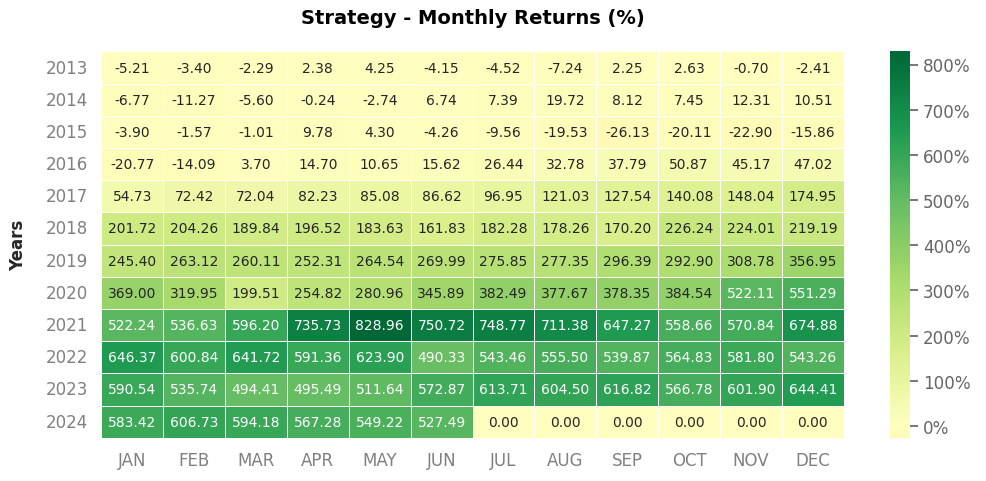
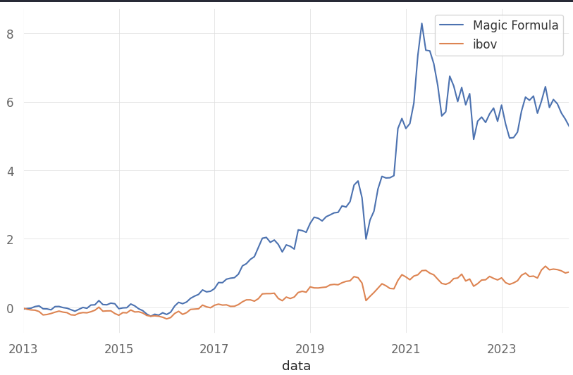

<h1 align="center"> Magic Formula </h1>

A Fórmula Mágica de Joel Grenblatt: The Little Book That Beats The Market  

  <a href="#-tecnologias">Tecnologias</a>&nbsp;&nbsp;&nbsp;|&nbsp;&nbsp;&nbsp;
  <a href="#memo-licença">Licença</a>

  

 

  
  

## 🚀 Tecnologias

Esse projeto foi desenvolvido com as seguintes tecnologias:

- pandas
- quantstats
- matplotlib

## 🍩 Artigo Sobre a Magica Formula

https://www.suno.com.br/artigos/formula-magica-de-joel-grenblatt-little-book-beats-market/

## :memo: Licença

Esse projeto está sob a licença MIT.

